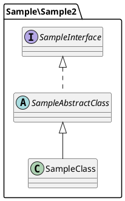

# PlantUML to PHP compiler

## Overview
Generate php code from plantuml files.

## Installation
Via Composer
```shell
composer require --dev puml2php/puml2php
```

## Usage
Assume you have a project with puml2php installed, and there are no files in the src directory yet.
```shell
$ ls
composer.json composer.lock sample.puml   src           vendor

$ tree src
src

0 directories, 0 files
```
As a sample, we will create a class diagram using PlantUML.

Specify the PlantUML file and run puml2php. Create a directory based on the package defined in PlantUML and generate each class file.  
If the namespace cannot be identified from composer.json, it will fail. Also, if the class file to be generated already exists, the process is skipped.
```shell
$ php vendor/bin/puml2php /path/to/sample.puml
Generating code from 'sample.puml'.

 - Created: src/Sample2/SampleInterface.php
 - Created: src/Sample2/SampleAbstractClass.php
 - Created: src/Sample2/SampleClass.php

Operations: 3 created, 0 skiped, 0 failed
```
```shell
$ tree src
src
└── Sample2
    ├── SampleAbstractClass.php
    ├── SampleClass.php
    └── SampleInterface.php

1 directory, 3 files
```

## License
The MIT License (MIT). Please see [LICENSE](https://github.com/tasuku43/puml2php/blob/main/LICENSE) for more information.
